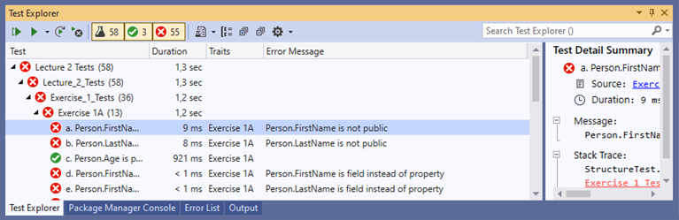

# Experimental OOP course 
The experimental OOP course is a set of self-evaluating exercises, which have been adapted from an OOP course taught at Aalborg University. The exercises are divided into individual lectures that are listed below.

[Lecture 2](./Lecture%202/Lecture%202%20Exercises.md)

[Lecture 3](./Lecture%203/Lecture%203%20Exercises.md)

[Lecture 4](./Lecture%204/Lecture%204%20Exercises.md)

[Lecture 9](./Lecture%209/Lecture%209%20Exercises.md)

## Setup
In order to make sure that the system works correctly, and that you can receive update please do the following: 
1. [Install Visual studio 2019](https://visualstudio.microsoft.com/downloads/)
2. [Install the .NET 5.0 SDK](https://dotnet.microsoft.com/download/dotnet/5.0)
3. [Create a fork for this repository](https://docs.github.com/en/github/getting-started-with-github/fork-a-repo)
4. [Clone *your* forked repository with Visual Studio](https://docs.microsoft.com/en-us/visualstudio/get-started/tutorial-open-project-from-repo-visual-studio-2019) 
5. Open the .sln-file of the relevant lecture. For example, open Lecture 2/Lecture 2.sln
6. [Install latest Explik.StructuralTestTools.MSBuild nuget package on the lecture test project](https://docs.microsoft.com/en-us/nuget/quickstart/install-and-use-a-package-in-visual-studio)
7. [Open the Test Explorer in Visual Studio](https://docs.microsoft.com/en-us/visualstudio/test/run-unit-tests-with-test-explorer?view=vs-2019)
8. Change the Test Explorer 'Group By' setting to to Project(1), Class(2), Traits(3)  

## Use 

To receive feedback on your exercise solutions, click the Test Explorer 'Run All Test Tests In View' button.

You are now ready to begin solving the exercises 🎉. 
